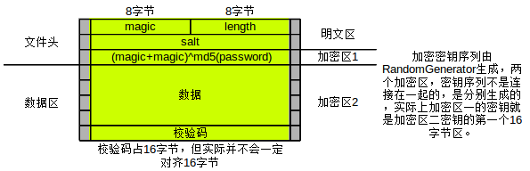

Encrypter
=========
一个加密工具

加密算法
====
**加密文件格式如下:**\

1. 明文区
    * magic为固定的魔数，用于分辨文件格式，内容为"zzprivat"
    * length为原文长度，以字节计算,是用小端序储存的long值(即低字节最先储存，高字节最后)
    * salt为每次加密都要重新生成的随机序列
2. 密文区,图上显示的是密文区的明文内容
    * (magic+magic)^md5(password)用于解密时分辨密码是否正确
    * 原始数据
    * 校验码用于保证数据的完整性

两个加密区分别使用流加密算法加密，密钥是(password+salt)

**校验码的计算方法:**

校验码的计算对象是由(length+data)连接成的序列，
计算由CheckSum类完成
，算法对输入数据进行分组，每组16字节,不足部分填0:\
buff(n)是储存输入数据的第n个分组\
sum(0)={0,0,0, ... ,0}\
sum(n)=md5(sum(n-1)+buff(n-1))\

流加密算法
=====

